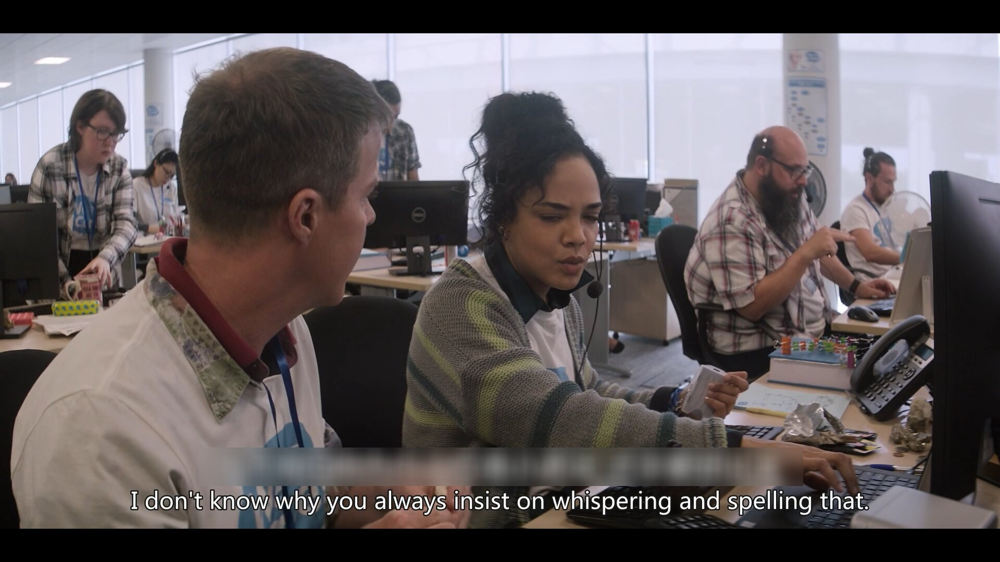
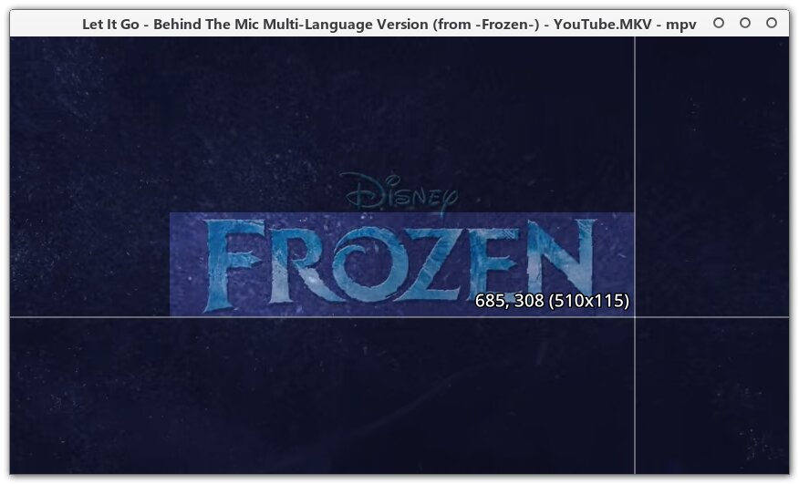
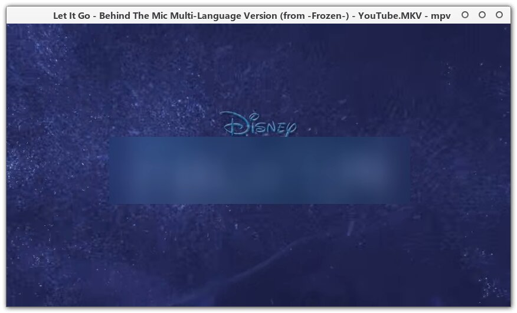
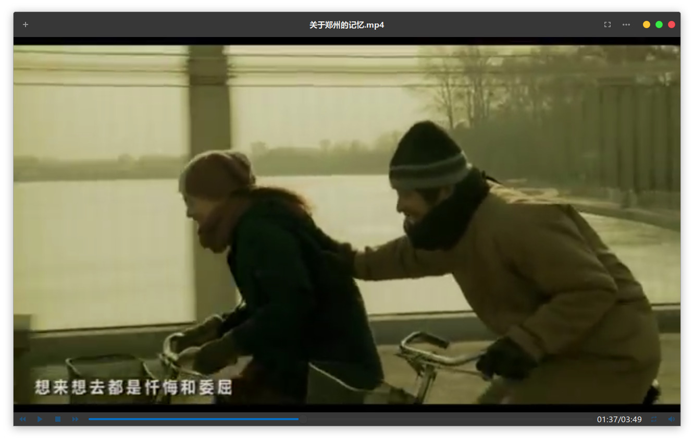
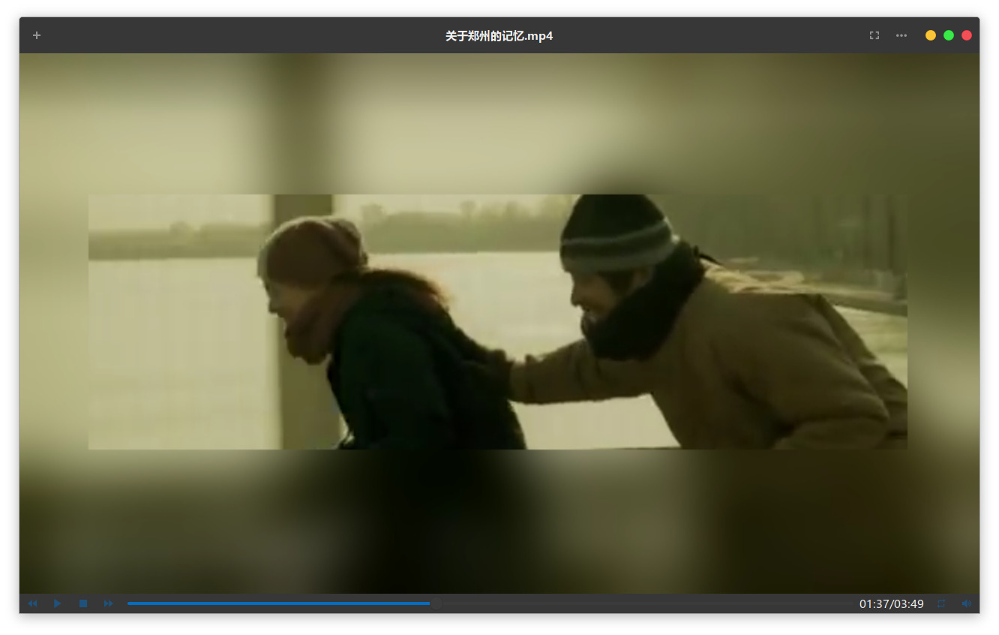

## Introduction

This is a plugin for mpv player or Celluloid (aka gnome-mpv).

It can be used to: 1. Blur any area you selected; 2. Blur entire video erea except the area you selected.

And it can adjust blur weight automatically according to the size of the area that you selected.

To install it, just download the file to your mpv scripts folder. Then you are ready to go. 

(On Linux, the scripts folder is `~/.config/mpv/scripts/` for mpv or `~/.config/celluloid/scripts/` for Celluloid.)

 

该插件适用于mpv播放器和Celluloid（也就是gnome-mpv）。

使用该插件你可以：1. 模糊你选定的任意区域； 2. 模糊除了你选定区域外的其他区域。

它会根据选区的大小自动调整模糊的程度。

直接下载该文件到mpv的scripts文件夹即可使用。

(在 Linux 上，mpv的scripts文件夹是 `~/.config/mpv/scripts/` ， Celluloid的scripts文件夹是`~/.config/celluloid/scripts/`)

 

You may find it useful to cover the built-in subtitle you don't what to see. For example, watching movies to study another language:

你可以用它来遮挡字幕（比如看双语片学外语的时候）：

## Usage

- ### Blur the selection:

  By default keyboard button <kbd>b</kbd> is used to toggle it on/off.  (You can assign another key if you like)

  Press key <kbd>b</kbd> and click on the first corner. Then move mouse to another corner and click again.

  默认使用按键 `b` 进行切换。激活的时候用鼠标点击选区的两个对角即可。

- ### Blur the entire video area except the selection:

  By default it is bind to  <kbd>CTRL + b</kbd> .

## Prompt

Maybe you will want to enable hardware decoding to reduce CPU usage. Linux users please click [here](https://github.com/mpv-player/mpv/wiki/Hardware-decoding-on-Linux).

你可能会想要开启硬解来降低CPU占用。Linux用户请点[这里](https://github.com/mpv-player/mpv/wiki/Hardware-decoding-on-Linux)。

 

> https://superuser.com/questions/901099/ffmpeg-apply-blur-over-face

Crop and lavfi setting codes are taken from [here](https://github.com/occivink/mpv-scripts).
